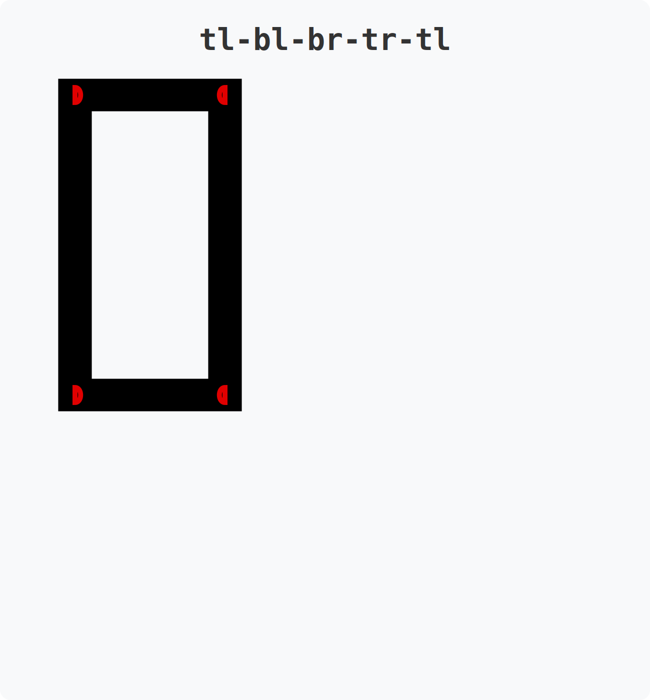
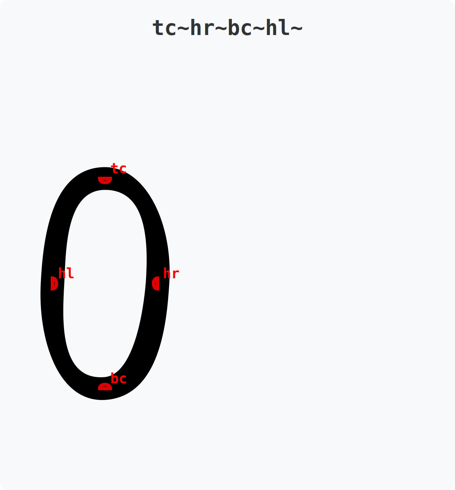
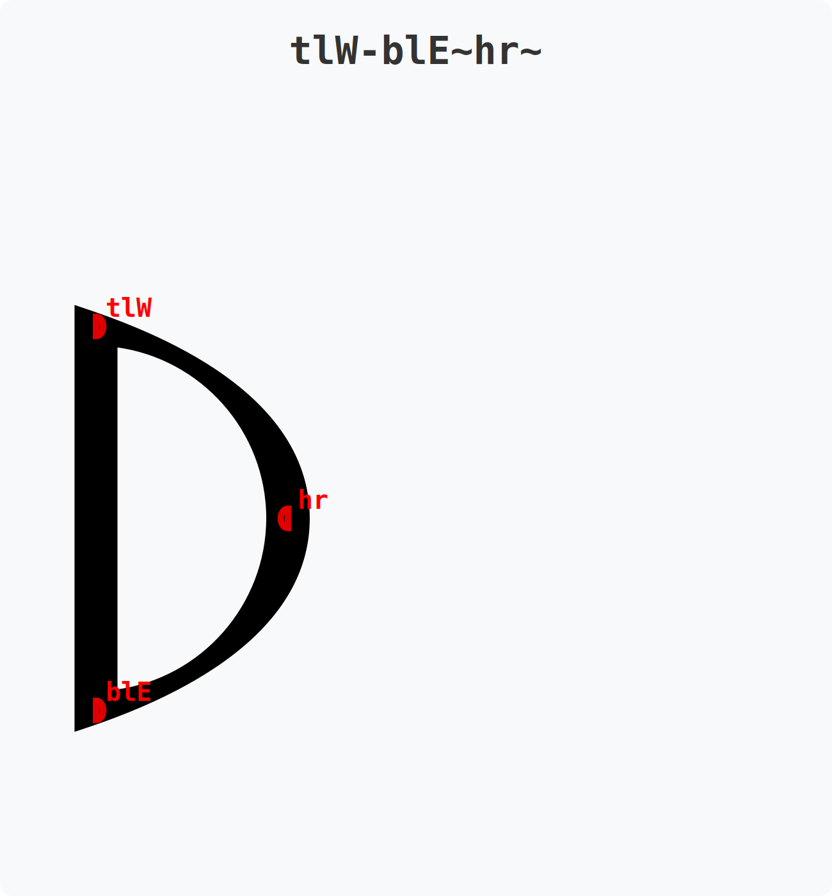

# Dactyl Glyphs

**Dactyl Glyphs** is a concise, text-based declarative language used within the Dactyl Font generator system to specify glyph outlines. Rather than placing control points on a Cartesian coordinate plane manually, Dactyl Glyphs use proportional letters relative to font metrics, intelligently routing smooth curves or sharp lines based on simple separators. 

This guide introduces the basics of writing a Dactyl Glyph string and using the **Glyphs** tab to test and debug your designs.

## Quick Examples
Before diving into the detailed syntax rules, here is what Dactyl Glyphs look like in practice:

- **`tl-bl-br-tr-`**: A perfectly straight-edged rectangle. Started at the Top-Left (`tl`), drew a straight line (`-`) to Bottom-Left (`bl`), then Bottom-Right (`br`), Top-Right (`tr`), and the trailing `-` tells it to loop back to the start.

- **`tc~hr~bc~hl~`**: A smooth circle. Starts at Top-Center (`tc`), curves (`~`) to Half-Right (`hr`), Bottom-Center (`bc`), Half-Left (`hl`), and the trailing `~` tells it to loop back to the start smoothly.

- **`tl-blE~hr~`**: A sharp corner mixing with curves (like a capital 'D'). Starts with a straight line from Top-Left (`tl`) to Bottom-Left (`bl`). At `bl`, an explicit tangent `E` (East) forces the upcoming curve to strictly shoot rightward, generating a sharp 90-degree corner against the vertical line, before curving through Half-Right (`hr`) and returning to Top-Left via the trailing `~`.

---

## 1. The Anatomy of a Point

A point in a Dactyl Glyph definition string is mapped to specific horizontal (X) and vertical (Y) typographic guides.

Each point typically takes the format:
`[Y-Coordinates][Offset?][X-Coordinates][Tangent?]`

### Y-Coordinates (Vertical)
Vertical coordinates are defined first. You can use single letters or combine them to average their heights (e.g., `tb` is halfway between top and bottom).
- `t`: Top (cap height)
- `x`: X-height
- `h`: Half total height
- `b`: Bottom (baseline)
- `d`: Descender

### X-Coordinates (Horizontal)
Horizontal coordinates follow the Y-coordinates.
- `l`: Left
- `c`: Center
- `r`: Right
- `w`: Wide (extends past the normal right boundary)

*Example:* `tl` puts a point at the top-left of the glyph bounding box. `bc` puts a point at the bottom-center.

### Weighting (Averaging & Repeats)
Combining several coordinate letters averages them, which lets you place a point at a fraction between guides. Repeating a letter weights the average toward it:
- `bt` (or `h`): halfway between bottom and top.
- `bbt`: one-third up from the bottom (two parts `b`, one part `t`).
- `rrrrc`: four-fifths of the way from center toward the right.

Because long runs are tedious, a **digit after a coordinate letter repeats it** that many times — pure shorthand for the weighting above, producing identical geometry:
- `b2t` is the same as `bbt`.
- `r4c` is the same as `rrrrc`.
- `t4h` is the same as `tttth`.

The digit binds to the single letter immediately before it, and works for both Y and X coordinates (and inside fitting brackets, e.g. `(r4c)`).

### Modifiers

#### Coordinate Fitting (Brackets)
By surrounding a coordinate in parentheses `()`, you allow the solver to "fit" it. This means the engine has permission to move the coordinate slightly to achieve a smoother curve.
- `t(l)`: The `t` (Y) is fixed, but `l` (X) can slide.
- `(t)l`: The `l` (X) is fixed, but `t` (Y) can slide.
- `(t)(l)`: Both are flexible.

#### Adjustments (Offsets)
You can inject a single letter between the Y and X coordinates to adjust the point vertically inward or outward relative to the glyph’s centerline:
- `o` (inward offset): Moves the point inward by the font's "roundedness" value.
- `e` (outward extended offset): Moves the point outward by the font's stroke "thickness".
*Example:* `tel` is a point at the Top-Left but shifted slightly outward.

### Explicit Tangents
You can optionally append a direction to explicitly force the curve's heading as it passes through the point:
- `N` (North), `S` (South), `E` (East), `W` (West)
*Example:* `blS` places a point at the bottom-left and mandates that curves entering or exiting this point must travel vertically downward (South).

---

## 2. Drawing Lines and Curves

Once you have defined your points, you stitch them together using separators to form the shapes (contours) of the glyph.

### Separators
- `-` (Dash): Draws a **straight line** between two points.
- `~` (Tilde): Draws a **smooth curve** between two points.
- ` ` (Space): Terminates a shape completely and starts a new one (sub-path). Used for disjointed glyphs like `!`, `=`, or `i`.

### Open vs. Closed Paths
By default, the sequence of points draws an **open** path from the first point to the last point.
- *Example:* `bl-tl-tr` draws a straight line from bottom-left to top-left, then a straight line to top-right.

To automatically close the shape (forming a continuous loop), simply leave a trailing `-` or `~` separator at the very end of your sequence. 
- *Example:* `tl-bl-br~tr~` loops the `tr` point back to the starting `tl` point via a curve.

### Solo Points → Dots
A sub-path string containing exactly one point (no separator at all) is rendered as a **filled dot** (circle) rather than a stroke.  This is how punctuation glyphs get their dots: the period `'.'` is defined as `"bl"` (a single bottom-left point), the colon `':'` as `"xbl bl"` (two separate sub-paths, each a solo point), and so on.

The dot diameter scales with the `thickness` axis.  Any valid point expression works — `hc` places a dot at the half-height centre, `bc` at the bottom-centre, etc.

*Example:* `tl-bl-br-tr- bc` draws a rectangle (closed via the trailing `-`) and then a separate dot at the bottom-centre — useful for building glyphs like `!` or `¡`.

---

## 3. Tangents and Corners: Advanced Rules

Dactyl Glyphs interpret topologies smartly depending on the combination of line/curve operators and explicit tangents. Mastering these rules is key to rendering robust outlines.

1. **Curves into Straight Lines (`~` into `-`)**
   When a point bridges a curve and a straight line (e.g., `tl~bl-br`), Dactyl Spline defaults to a **smooth** transition. The curve will seamlessly align its outgoing tangent to gracefully match the heading of the straight line.
2. **Sharp Corners (Curve + Line + Explicit Tangent)**
   To create a sharp corner where a curve meets a straight line, provide an explicit tangent at the junction point (e.g., `tl~blS-br`). Because tangents strictly only apply to the curve side of a line/curve join, the engine overrides the smooth transition to produce a discontinuous sharp corner. The curve arriving at `bl` will face South, while the line exiting `bl` will independently travel toward `br`.
3. **No Tangents on Strict Lines**
   If a point acts merely as a vertex between two straight lines (e.g., `tl-bl-br`), or terminates a straight open path, **you cannot assign it an explicit tangent.** Attempting to define an explicit tangent (e.g., `tl-blS-br`) will throw a runtime exception, as straight lines are rigidly bound to their endpoints and have no mathematical flexibility to accept curvature tangents.

---

## 4. The Glyphs Tab

The generator UI features a **Glyphs** tab, an invaluable tool for creating and debugging your Dactyl Glyphs definitions in real time.

### How to Use It
1. **Live Preview:** Enter your Dactyl Glyphs string into the definition editor. The browser instantly renders the resulting glyph geometry on screen.
2. **Visual Diagnostics:** The browser overlays essential debugging features over the rendered stroke:
   - **Knots:** Shows the exact solved coordinates of every parsed point.
   - **Tangents:** Visualizes the incoming and outgoing tangent vectors at each knot (especially helpful for confirming sharp corners vs. smooth joins).
   - **Comb:** Provides a "comb" heat map that visualizes the rate of curvature along bezier segments. Spikes or uneven comb distribution indicate jagged transitions that you might wish to fix via coordinate fitting (brackets) or explicit tangents.
3. **Toggle DactylSpline / Spline2 / Spiro:** Use the checkboxes to view how your string behaves under the three available solvers — the newer robust **DactylSpline**, Raph Levien's **Spline2**, and the legacy **Spiro** solver.
   - *Note on Spiro Limitations:* The legacy `Spiro` matrix solver may struggle or throw exceptions on tightly packed closed loops containing only three points (such as `tl-blE~hr~`). Using the robust `DactylSpline` backend handles these topologies elegantly.

By iterating within the Glyphs tab, you can visually tune specific coordinate points and explicit tangents until your glyph achieves a flawless, production-ready continuous outline!
