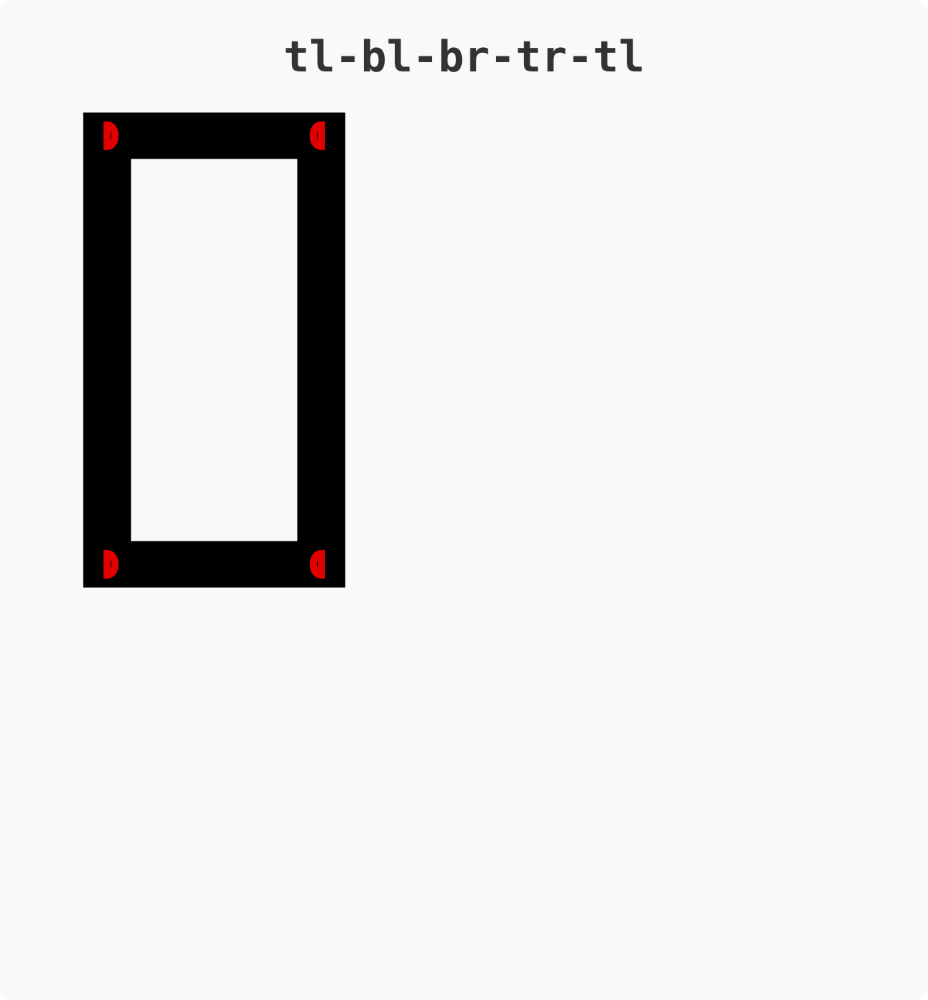
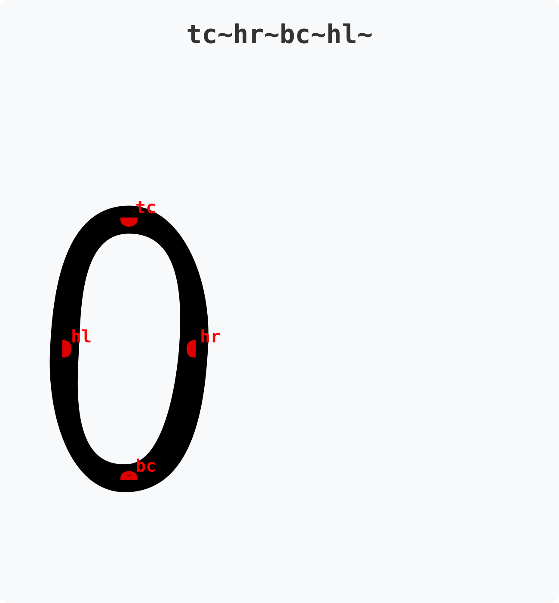
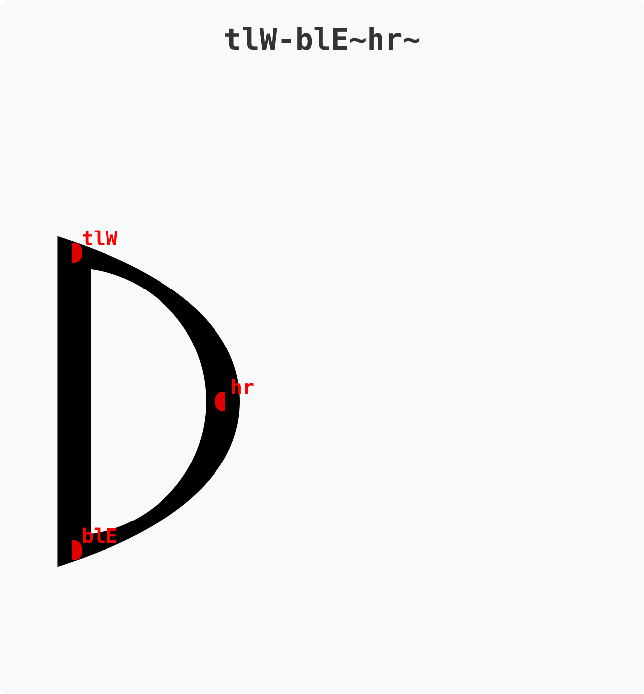

# Dactyl Glyphs

**Dactyl Glyphs** is a concise, text-based declarative language used within the Dactyl Font generator system to specify glyph outlines. Rather than placing control points on a Cartesian coordinate plane manually, Dactyl Glyphs use proportional letters relative to font metrics, intelligently routing smooth curves or sharp lines based on simple separators. 

This guide introduces the basics of writing a Dactyl Glyph string and using the **Glyphs** tab to test and debug your designs.

The actual glyph definition strings for every character live in [`src/generator/GlyphStringDefs.fs`](https://github.com/terryspitz/dactyl-font/blob/master/src/generator/GlyphStringDefs.fs).

## Quick Examples
Before diving into the detailed syntax rules, here is what Dactyl Glyphs look like in practice:

- **`tl-bl-br-tr-`**: A perfectly straight-edged rectangle. Started at the Top-Left (`tl`), drew a straight line (`-`) to Bottom-Left (`bl`), then Bottom-Right (`br`), Top-Right (`tr`), and the trailing `-` tells it to loop back to the start.

- **`tc~hr~bc~hl~`**: A smooth circle. Starts at Top-Center (`tc`), curves (`~`) to Half-Right (`hr`), Bottom-Center (`bc`), Half-Left (`hl`), and the trailing `~` tells it to loop back to the start smoothly.

- **`tl-blE~hr~`**: A sharp corner mixing with curves (like a capital 'D'). Starts with a straight line from Top-Left (`tl`) to Bottom-Left (`bl`). At `bl`, an explicit tangent `E` (East) forces the upcoming curve to strictly shoot rightward, generating a sharp 90-degree corner against the vertical line, before curving through Half-Right (`hr`) and returning to Top-Left via the trailing `~`.

---

## 1. The Anatomy of a Point

A point in a Dactyl Glyph definition string is mapped to specific horizontal (X) and vertical (Y) typographic guides.

Each point typically takes the format:
`[Y-Coordinates][Offset?][X-Coordinates][Offset?][Tangent?][Corner?][Joint?]`

### Y-Coordinates (Vertical)
Vertical coordinates are defined first. You can use single letters or combine them to average their heights (e.g., `tb` is halfway between top and bottom).
- `t`: Top (cap height)
- `x`: X-height
- `h`: Half total height
- `b`: Bottom (baseline)
- `d`: Descender

### X-Coordinates (Horizontal)
Horizontal coordinates follow the Y-coordinates.
- `l`: Left
- `c`: Center
- `r`: Right
- `w`: Wide (extends past the normal right boundary)

*Example:* `tl` puts a point at the top-left of the glyph bounding box. `bc` puts a point at the bottom-center.

### Weighting (Averaging & Repeats)
Combining several coordinate letters averages them, which lets you place a point at a fraction between guides. Repeating a letter weights the average toward it:
- `bt` (or `h`): halfway between bottom and top.
- `bbt`: one-third up from the bottom (two parts `b`, one part `t`).
- `rrrrc`: four-fifths of the way from center toward the right.

Because long runs are tedious, a **digit after a coordinate letter repeats it** that many times — pure shorthand for the weighting above, producing identical geometry:
- `b2t` is the same as `bbt`.
- `r4c` is the same as `rrrrc`.
- `t4h` is the same as `tttth`.

The digit binds to the single letter immediately before it, and works for both Y and X coordinates (and inside fitting brackets, e.g. `(r4c)`).

### Modifiers

#### Coordinate Fitting (Brackets)
By surrounding a coordinate in parentheses `()`, you allow the solver to "fit" it. This means the engine has permission to move the coordinate slightly to achieve a smoother curve.
- `t(l)`: The `t` (Y) is fixed, but `l` (X) can slide.
- `(t)l`: The `l` (X) is fixed, but `t` (Y) can slide.
- `(t)(l)`: Both are flexible.

When a fitted point has no explicit tangent, the parser **automatically assigns a cardinal direction** based on the axis that is free to move:
- A **Y-fitted** point (e.g. `(t)l`, where Y slides along a fixed X) gets a **vertical tangent** (N or S), derived from whether its neighbours are above or below it.
- An **X-fitted** point (e.g. `t(l)`, where X slides along a fixed Y) gets a **horizontal tangent** (E or W), derived from whether its neighbours are to the right or left.

This only applies to interior points on closed paths or multi-point open paths — not open-path endpoints. It ensures that a fitted extremum (e.g. the leftmost point of an arc) curves smoothly without requiring an explicit `N`, `S`, `E`, or `W` suffix.

#### Adjustments (Offsets)
You can inject a single letter between the Y and X coordinates to adjust the point vertically inward or outward relative to the glyph’s centerline:
- `o` (inward offset): Moves the point inward by the font's "roundedness" value.
- `e` (outward extended offset): Moves the point outward by the font's stroke "thickness".
*Example:* `tel` is a point at the Top-Left but shifted slightly outward.

The same `o`/`e` letters may also appear **after** the X coordinate, where
they adjust the point horizontally inward/outward toward the glyph's vertical
centerline instead. This is used to carve short flat "shoulders" onto bowls
(e.g. the tops of `B`, `D`, `P`, `R`) whose length shrinks as roundedness
increases — at `roundedness=0` the shoulder spans 90% of the glyph width
(a near-flat, square edge), shrinking down to a modest flat (13% of width)
at `roundedness=100`, so lower roundedness gives a noticeably squarer
letterform.
*Example:* `tlo` is a point at the Top-Left, shifted inward (rightward) by an
amount that grows as roundedness decreases.

Leave the shoulder point's tangent implicit (don't add an explicit `E`/`W`)
when the straight line into it is already headed the direction you want the
curve to leave in — e.g. `tl-tlo~(th)r` rather than `tl-tloE~(th)r`. The
smooth-transition default (see rule 1 below) already aligns the curve to the
line's heading, and forcing an explicit tangent there makes the join a
`Corner` even though no direction actually changes, which produces a spurious
spike when the outline is stroked.

### Explicit Tangents
You can optionally append a direction to explicitly force the curve's heading as it passes through the point:
- `N` (North), `S` (South), `E` (East), `W` (West)
*Example:* `blS` places a point at the bottom-left and mandates that curves entering or exiting this point must travel vertically downward (South).

### Explicit Corners (`K`)

A straight line running into a curve (`-` then `~`) is *smoothed* by default: the
curve is forced to leave along the line's heading (see rule 1 below), and two
curves either side of a point (`~` `~`) are joined smoothly. That is what you
want for a stem flowing into a shoulder, but not where a stroke changes direction
sharply — the stem of `5` turning into its bowl, or the waist of `3` where the
upper bowl doubles back into the lower one.

Append a trailing **`K`** (kink) to make the point a **corner**: tangent
continuity is broken there, and by default *both* tangents are left free, so the
solver picks each side's own natural direction out of (or into) the kink. The
curve therefore keeps exactly the shape it would have had as a separate stroke,
but is now part of one continuous outline instead of two overlapping strokes
whose end caps left a notch at the join.
- *Example:* `5 = "tr-tl-hlK~ttb(c)~(bbt)r~b(c)~bol"` — the bar, stem and bowl
  are a single stroke; `hlK` is the acute join where the stem meets the bowl, and
  the bowl springs back out of it at whatever angle the solver likes.
- *Example:* `m = "xl-bl xolJ~x(llw)~xxblwK~x(rw)~xxbw-bw xxblwJ-blw"` — both
  arches are one stroke, kinked over the middle leg, and the leg hangs off that
  kink as a joint.

`K` works at any junction (line→curve, curve→line and curve→curve, where it gives
a cusp) and composes with the other modifiers: `hlKJ` is a corner that is also an
interior joint.

A kink can be as sharp as the design wants — the outline builder does not need it
softened. On the inner side of a sharp corner there is no single point belonging
to both offset edges, so it ends the incoming edge where that edge really ends,
starts the outgoing edge where it really starts, and lets the two bodies overlap;
the nonzero fill rule unions them. Both edges therefore stay true to their own
stroke however acute the kink is. (A bisector miter instead lands off both edges,
which used to taper `5`'s stem visibly into its bowl join.)

#### Tangents at a kink

Adding a direction to a kink pins it, but the letter names the tangent's **axis**
rather than one heading: each side is oriented along its own direction of travel
— into the point from the previous knot, out of it toward the next. So `E` at a
kink means "horizontal in and out".

That distinction matters wherever a stroke doubles back. Writing the same East
heading on both sides of `3`'s waist would ask the upper bowl to *arrive*
travelling east while coming from the east, and it would loop; oriented per side
it arrives travelling west and leaves travelling east, giving a level waist. A
tangent on a point *without* `K` still applies verbatim to both sides.
- *Example:* `3 = "tol~t(c)~(th)r~hllrEK~(bh)r~b(c)~bol"` — the upper bowl runs
  straight into the lower one through a level cusp at the waist.

Where three strokes meet, prefer to kink the two that flow into each other and
let the third branch off as a joint — and pick the third so its cap lands where
the other two are thickest. In `m` the two arches kink and the leg branches, so
the leg's cap is buried under arch ink on both sides rather than sitting out in
the thin crotch between the arches.

### Explicit Joints (`J`)
Many letters are drawn as several separate strokes that **meet in the middle**
of another stroke rather than at a free end — the crossbar of `A`, the leg of
`R` springing off the bowl, the arches of `m` springing off the stem. At such
an **interior joint** you do *not* want the stroke end decorated like a free
terminal: a serif, flare or end-bulb poking out of the middle of the letter
looks wrong.

Append a trailing **`J`** to the endpoint that lands on another stroke to
declare it an interior joint. Its cap (serif / flare / bulb) is then suppressed
and the join is cleanly aligned instead.
- *Example:* in `R = "bl-tl-tlo~(th)r~hlo-hlJ hloJ-br"`, the bowl end `hlJ` and
  the leg top `hloJ` are joints, while the leg foot `br` stays a real terminal
  that still receives a serif.

The generator also has a geometric heuristic (the debug **`joints`** axis) that
auto-detects joints where an endpoint lands on a *straight* segment of another
stroke. The explicit `J` marker is more reliable: it also covers endpoints that
land on **curves** (which the heuristic cannot see) or that sit just past a
neighbouring stroke's last knot, and it applies regardless of the `joints`
axis. Prefer marking joints explicitly with `J`.

---

## 2. Drawing Lines and Curves

Once you have defined your points, you stitch them together using separators to form the shapes (contours) of the glyph.

### Separators
- `-` (Dash): Draws a **straight line** between two points.
- `~` (Tilde): Draws a **smooth curve** between two points.
- ` ` (Space): Terminates a shape completely and starts a new one (sub-path). Used for disjointed glyphs like `!`, `=`, or `i`.

### Open vs. Closed Paths
By default, the sequence of points draws an **open** path from the first point to the last point.
- *Example:* `bl-tl-tr` draws a straight line from bottom-left to top-left, then a straight line to top-right.

To automatically close the shape (forming a continuous loop), simply leave a trailing `-` or `~` separator at the very end of your sequence. 
- *Example:* `tl-bl-br~tr~` loops the `tr` point back to the starting `tl` point via a curve.

### Solo Points → Dots
A sub-path string containing exactly one point (no separator at all) is rendered as a **filled dot** (circle) rather than a stroke.  This is how punctuation glyphs get their dots: the period `'.'` is defined as `"bl"` (a single bottom-left point), the colon `':'` as `"xbl bl"` (two separate sub-paths, each a solo point), and so on.

The dot diameter scales with the `thickness` axis.  Any valid point expression works — `hc` places a dot at the half-height centre, `bc` at the bottom-centre, etc.

*Example:* `tl-bl-br-tr- bc` draws a rectangle (closed via the trailing `-`) and then a separate dot at the bottom-centre — useful for building glyphs like `!` or `¡`.

---

## 3. Tangents and Corners: Advanced Rules

Dactyl Glyphs interpret topologies smartly depending on the combination of line/curve operators and explicit tangents. Mastering these rules is key to rendering robust outlines.

1. **Curves into Straight Lines (`~` into `-`)**
   When a point bridges a curve and a straight line (e.g., `tl~bl-br`), Dactyl Spline defaults to a **smooth** transition. The curve will seamlessly align its outgoing tangent to gracefully match the heading of the straight line.
2. **Sharp Corners (Curve + Line + Explicit Tangent)**
   To create a sharp corner where a curve meets a straight line, provide an explicit tangent at the junction point (e.g., `tl~blS-br`). Because tangents strictly only apply to the curve side of a line/curve join, the engine overrides the smooth transition to produce a discontinuous sharp corner. The curve arriving at `bl` will face South, while the line exiting `bl` will independently travel toward `br`.
3. **No Tangents on Strict Lines**
   If a point acts merely as a vertex between two straight lines (e.g., `tl-bl-br`), or terminates a straight open path, **you cannot assign it an explicit tangent.** Attempting to define an explicit tangent (e.g., `tl-blS-br`) will throw a runtime exception, as straight lines are rigidly bound to their endpoints and have no mathematical flexibility to accept curvature tangents.

---

## 4. Optical Corrections (`overshoot` and `balance`)

Two axes quietly adjust the coordinates you write, because geometry and
perception disagree about what "the same height" and "the middle" look like
(see Hoefler & Co.'s [Typographic
Illusions](https://www.typography.com/blog/typographic-illusions)).  Both are
applied by the parser, so every glyph definition inherits them for free — you
write the ideal geometry and the axes handle the illusion.  Set either to `0`
to draw exactly what you wrote.

### `overshoot` — round and pointed extremes grow past the guides
A circle drawn to the same height as a square reads as smaller, and a shape
that converges to a point reads smaller still.  So a knot that is an **extreme
of the outline sitting on a guide** (`t`, `x`, `b` or `d`) is pushed a little
past that guide:

- **Round extremes** — a knot with a fitted X coordinate (`t(c)`, the flat top
  of a bowl) or with a curve on at least one side — move out by `overshoot`.
  This is what makes `O`, `S`, `C`, `o`, `e` and `6` taller than `T` and `H`.
- **Pointed extremes** — a corner between two straight lines whose neighbours
  lie on *opposite* sides horizontally, i.e. a genuine wedge — move out by
  1.5 × `overshoot`: the apex of `A`, `V` and `v`, and the middle vertex of
  `M` and `W`.

Everything else stays exactly on the guide: flat tops and feet (`T`, `E`, `L`),
open-path endpoints (the terminals of `C` and `c`), and corners that don't
converge to a point (the top of `M`'s left stem, `N`'s stem/diagonal
junction).

### `balance` — mid heights sit above the geometric middle
We read a letter whose crossbar is arithmetically centred as bottom-heavy, so
heights that fall *between* the guides are raised by up to `balance` units:

- A height written as a **single guide letter** (`t`, `x`, `b`, `d`) is a
  reference line and never moves — the x-height stays flat across `x`, `z`
  and the crossbar of `f`.
- Any **mixed or half height** takes the raise: `h` (the crossbar of `H`, `E`,
  `F` and the waist of `B` and `S`), `xb` (the bar of `e`), `bh` (the crossbar
  of `A`), and so on.
- **Fitted heights** — `(h)l`, `(xb)r` — are the *side* extremes of round
  letters and stay where they are, so `O` and `o` stay symmetric.

The raise follows a sine curve that is zero at the baseline and at cap height
and peaks at the half height, so `h` gets the full `balance` and `bh` (a
quarter up) about 70% of it.  Below the baseline it has faded to nothing, so
descender geometry is untouched.

---

## 5. The Glyphs Tab

The generator UI features a **Glyphs** tab, an invaluable tool for creating and debugging your Dactyl Glyphs definitions in real time.

### How to Use It
1. **Live Preview:** Enter your Dactyl Glyphs string into the definition editor. The browser instantly renders the resulting glyph geometry on screen.
2. **Visual Diagnostics:** The browser overlays essential debugging features over the rendered stroke:
   - **Knots:** Shows the exact solved coordinates of every parsed point.
   - **Tangents:** Visualizes the incoming and outgoing tangent vectors at each knot (especially helpful for confirming sharp corners vs. smooth joins).
   - **Comb:** Provides a "comb" heat map that visualizes the rate of curvature along bezier segments. Spikes or uneven comb distribution indicate jagged transitions that you might wish to fix via coordinate fitting (brackets) or explicit tangents.
3. **Toggle DactylSpline / Spline2 / Spiro:** Use the checkboxes to view how your string behaves under the three available solvers — the newer robust **DactylSpline**, Raph Levien's **Spline2**, and the legacy **Spiro** solver.
   - *Note on Spiro Limitations:* The legacy `Spiro` matrix solver may struggle or throw exceptions on tightly packed closed loops containing only three points (such as `tl-blE~hr~`). Using the robust `DactylSpline` backend handles these topologies elegantly.

By iterating within the Glyphs tab, you can visually tune specific coordinate points and explicit tangents until your glyph achieves a flawless, production-ready continuous outline!
